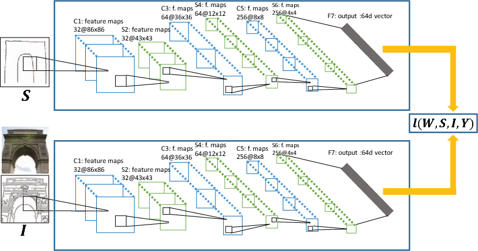
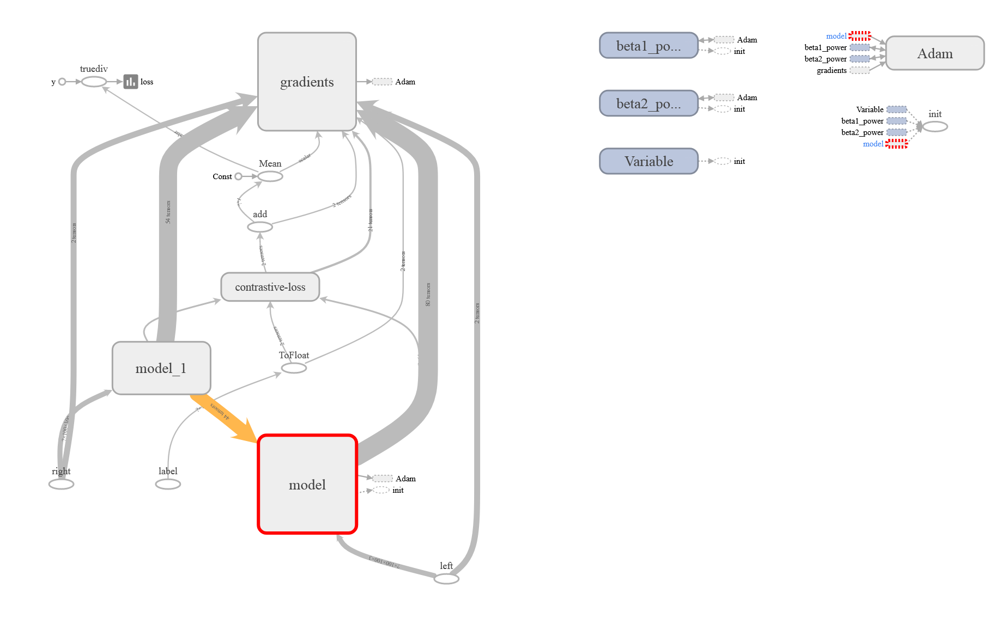

# Sketch-Retrieval---Siamese

# Introduction

Image retrieval using hand-free sketches drawn by amateurs is an interesting and challenging problem. In this project, Siamese network has been employed to learn the similarity between a sketch-photo pair. For a given sketch the model searches the most closely matched photos from a large image dataset.

# Overview

A sketch speaks a “hundred” of words, which makes it a more efficient and precise query modality (e.g. shape, pose, style of a handbag) than text. Words are not always the most convenient way to describe the exact object people want to search, especially when it comes to fine-grained object details.

The main idea is to pull output feature vectors closer for input sketch-image pairs that are labeled as similar, and push them away if irrelevant. This is implemented in code using a 'contrastive' loss function.

## Model 

A Siamese CNN is composed of two identical CNN with shared weights. The proposed network trains on the difference between the feature vectors of the image and the sketch. 

The graph is shown below:

## Dataset 

The dataset used is called Sketchy, which is a large-scale collection of sketch-photo pairs. Crowd workers were asked to sketch particular photographic objects sampled from 125 categories and acquire 75,471 sketches of 12,500 objects. 
